# Client-Side Kuzu Security Architecture

## Executive Summary

After comprehensive investigation, **server-side KuzuDB is not feasible in Cloudflare Workers** due to filesystem dependencies in the C++ library. However, **client-side validation can be made cryptographically secure** with proper architecture.

## Why Server-Side Failed

All WASM compilation approaches are blocked:

| Approach                      | Blocker                                               |
| ----------------------------- | ----------------------------------------------------- |
| Emscripten                    | Requires WORKERFS → needs Web Workers (not supported) |
| WASI                          | Experimental, missing syscalls Kuzu needs             |
| Rust (wasm32-unknown-unknown) | No filesystem support                                 |
| Python/Pyodide                | Kuzu not in Pyodide packages                          |

**Root Cause:** Kuzu's C++ library requires filesystem operations that are fundamentally incompatible with all Workers WASM targets.

## System Architecture Overview

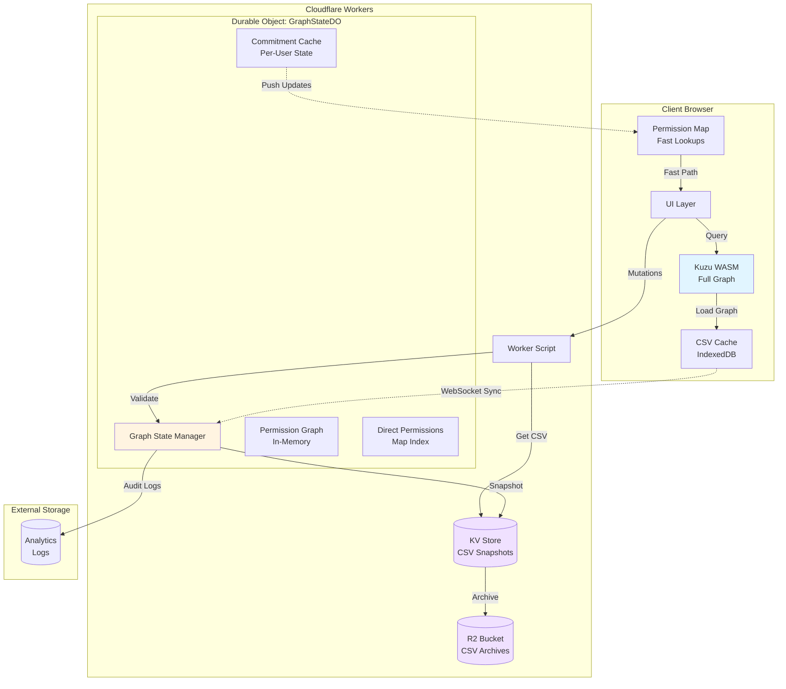

## Component Responsibilities

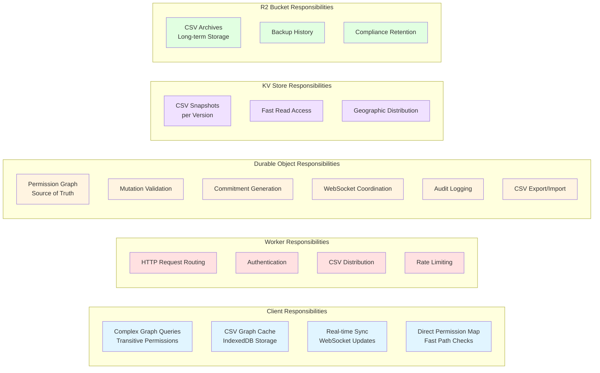

## Secure Client-Side Architecture

### Core Principle

**The server is the source of truth; the client is the query engine.**

### Permission Check Flow

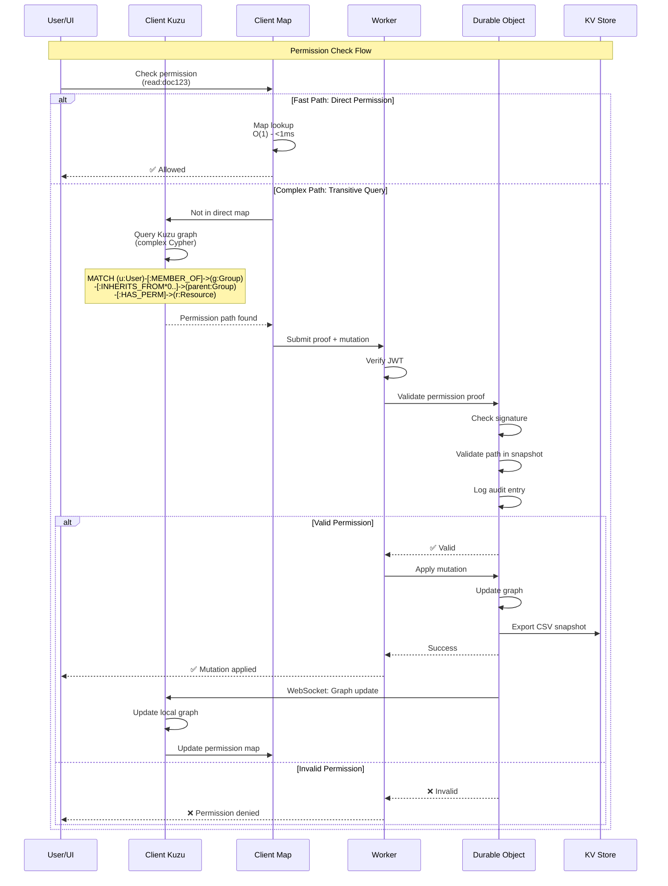

### CSV Maintenance Flow

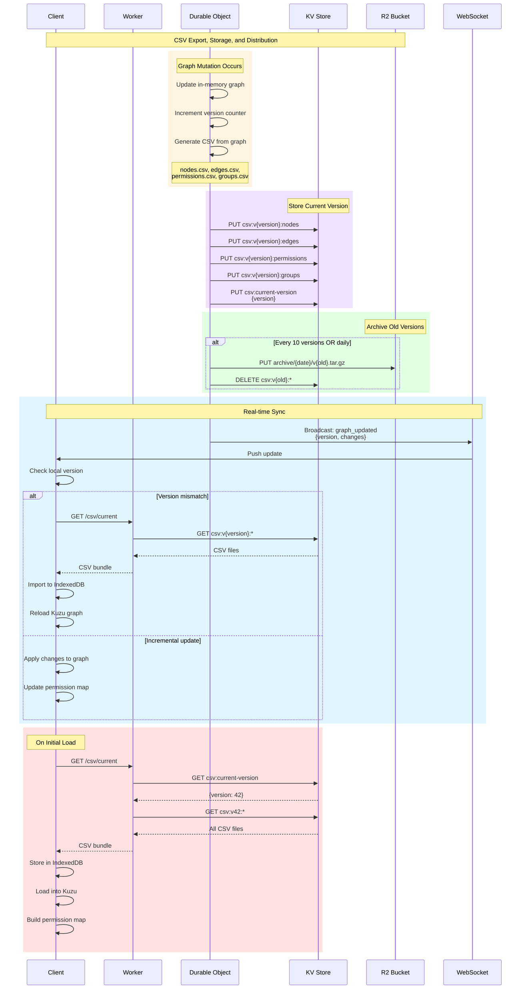

### Mutation and CRUD Flow

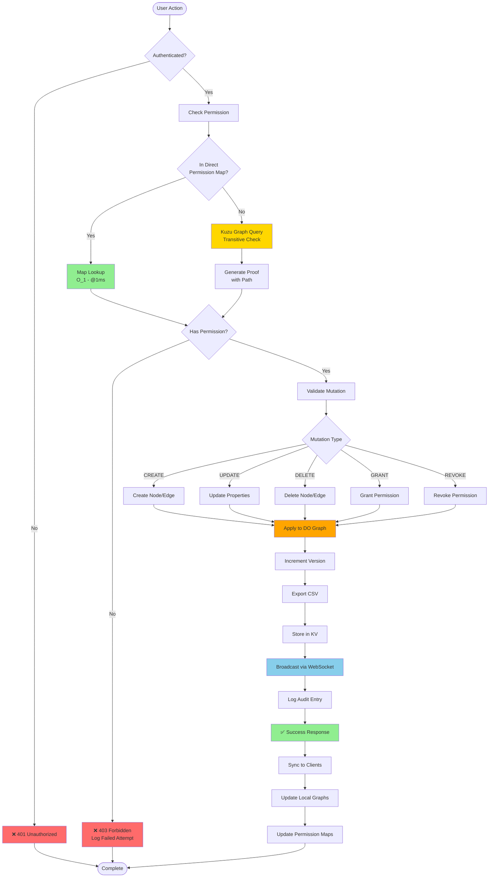

### Security Model: Edge-Based Validation

**Key Insight**: Instead of validating path structure, we validate **exact edge IDs**. The client finds the shortest permission path and returns the edge IDs. The server simply checks if those edges exist in its graph.

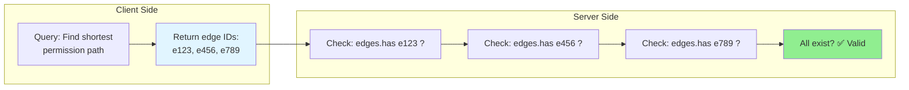

#### Server-Side Edge Storage

```typescript
// ============================================================================
// SERVER: Edge-Based Permission Graph
// ============================================================================

interface Edge {
  id: string;              // Stable edge ID (UUID)
  type: string;            // MEMBER_OF, INHERITS_FROM, HAS_PERMISSION
  sourceId: string;        // Source node ID
  targetId: string;        // Target node ID
  properties: Record<string, any>; // capability, etc.
  createdAt: number;
  revokedAt?: number;      // Soft delete for audit trail
}

class GraphStateDO {
  // O(1) edge lookup by ID
  private edges: Map<string, Edge> = new Map();
  
  // O(1) edge lookup by type and source
  private edgesBySource: Map<string, Set<string>> = new Map();
  
  // Fast permission path validation
  async validatePermissionPath(edgeIds: string[]): Promise<{
    valid: boolean;
    reason?: string;
    invalidEdgeId?: string;
  }> {
    for (const edgeId of edgeIds) {
      const edge = this.edges.get(edgeId);
      
      // Edge must exist
      if (!edge) {
        return {
          valid: false,
          reason: 'Edge does not exist',
          invalidEdgeId: edgeId
        };
      }
      
      // Edge must not be revoked
      if (edge.revokedAt) {
        return {
          valid: false,
          reason: 'Edge has been revoked',
          invalidEdgeId: edgeId
        };
      }
    }
    
    return { valid: true }; // All edges valid
  }
}

// ============================================================================
// CLIENT: Query for Shortest Path with Edge IDs
// ============================================================================

async function checkPermission(
  userId: string, 
  resourceId: string, 
  capability: string
): Promise<PermissionProof | null> {
  const result = await clientKuzu.query(`
    MATCH path = (u:User {id: $userId})
      -[r1:MEMBER_OF]->(g:Group)
      -[r2:INHERITS_FROM*0..]->(parent:Group)
      -[r3:HAS_PERMISSION {capability: $capability}]->(r:Resource {id: $resourceId})
    WITH path, 
         [rel in relationships(path) | id(rel)] as edgeIds,
         length(path) as pathLength
    ORDER BY pathLength ASC
    LIMIT 1
    RETURN edgeIds, pathLength
  `);
  
  if (result.numRows === 0) {
    return null; // No permission path found
  }
  
  return {
    userId,
    resourceId,
    capability,
    edgeIds: result.rows[0].edgeIds,
    pathLength: result.rows[0].pathLength
  };
}

// ============================================================================
// Simplified Commitment (No Inheritance Snapshot Needed!)
// ============================================================================

interface PermissionCommitment {
  userId: string;
  permissions: string[]; // Direct permissions (fast path)
  timestamp: number;
  signature: string; // HMAC-SHA256
  
  // No need for inheritanceSnapshot - we validate edges directly!
}

async function generateCommitment(
  userId: string
): Promise<PermissionCommitment> {
  const permissions = await getDirectPermissions(userId);

  const commitment = {
    userId,
    permissions,
    timestamp: Date.now(),
  };

  commitment.signature = await hmacSign(
    JSON.stringify(commitment),
    SERVER_SECRET
  );

  return commitment;
}

// ============================================================================
// Benefits of Edge-Based Validation
// ============================================================================
```

| Aspect | Edge-Based with Chain Validation (Proposed) | Structure-Based (Original) |
|--------|------------|------------------------------|
| **Validation Complexity** | O(n) edge lookups + O(n) chain check | O(n²) path structure check |
| **Server Logic** | Simple: `edges.has(id)` + connectivity check | Complex: validate graph structure |
| **Chain Validation** | Verify edge[i].target = edge[i+1].source | Implicit in structure validation |
| **Audit Trail** | Exact edges that granted permission | Path description only |
| **Debugging** | Traceable edge IDs with connectivity | Abstract path |
| **Performance** | ~1ms per edge + ~1ms chain check | ~10ms path validation |
| **Security** | Can't forge edge IDs (UUIDs) + can't submit disconnected edges | Could claim false path |
| **Storage** | Map<id, Edge> with sourceId/targetId | Snapshot of full hierarchy |
| **Commitment Size** | Small (direct perms only) | Large (includes inheritance) |


async function submitMutation(mutation: Mutation, proof: PermissionProof) {
  // Client signs the proof
  proof.clientSignature = await signWithSessionKey(proof);

  const response = await fetch("/api/mutate", {
    method: "POST",
    body: JSON.stringify({ mutation, proof }),
    headers: { Authorization: `Bearer ${sessionToken}` },
  });

  return response.json();
### Permission Check Flow (Edge-Based Validation)

```mermaid
sequenceDiagram
    participant U as User/UI
    participant C as Client Kuzu
    participant CM as Client Map
    participant W as Worker
    participant DO as Durable Object
    participant Edges as Edge Store<br/>(Map&lt;id Edge&gt;)
    participant KV as KV Store

    Note over U,KV: Permission Check Flow with Edge Validation

    U->>CM: Check permission<br/>(read:doc123)
    
    alt Fast Path: Direct Permission
        CM->>CM: Map lookup<br/>O(1) - &lt;1ms
        CM-->>U: ✅ Allowed
    else Transitive Path: Edge-Based Query
        CM->>C: Not in direct map
        C->>C: Query for shortest path<br/>with edge IDs
        Note over C: MATCH path = (u)-[*]->(r)<br/>RETURN [rel in relationships(path) | id(rel)]<br/>ORDER BY length(path) LIMIT 1
        C-->>CM: Found path:<br/>edgeIds=['e123' 'e456' 'e789']
        
        CM->>W: Submit proof + mutation<br/>{edgeIds userId resourceId}
        W->>W: Verify JWT
        W->>DO: Validate edge IDs
        
        loop For each edge ID
            DO->>Edges: edges.has(edgeId)?
            Edges-->>DO: ✅ exists not revoked
        end
        
        DO->>DO: Verify chain connectivity<br/>edge[i].target = edge[i+1].source
        DO->>DO: Check user → ... → resource
        DO->>DO: All edges valid + connected ✅
        DO->>DO: Log audit entry<br/>(with exact edge IDs)
        
        alt Valid Permission
            DO-->>W: ✅ Valid
            W->>DO: Apply mutation
            DO->>DO: Update graph
            DO->>Edges: Add/update edges
            DO->>KV: Export CSV snapshot
            DO-->>W: Success
            W-->>U: ✅ Mutation applied
            
            DO->>C: WebSocket: Graph update<br/>{addedEdges removedEdges}
            C->>C: Update local graph
            C->>CM: Update permission map
        else Invalid Permission
            Note over DO: Edge missing or revoked
            DO-->>W: ❌ Invalid edge IDs
            W-->>U: ❌ Permission denied
        end
    end
```

## Edge-Based Validation: Complete Flow

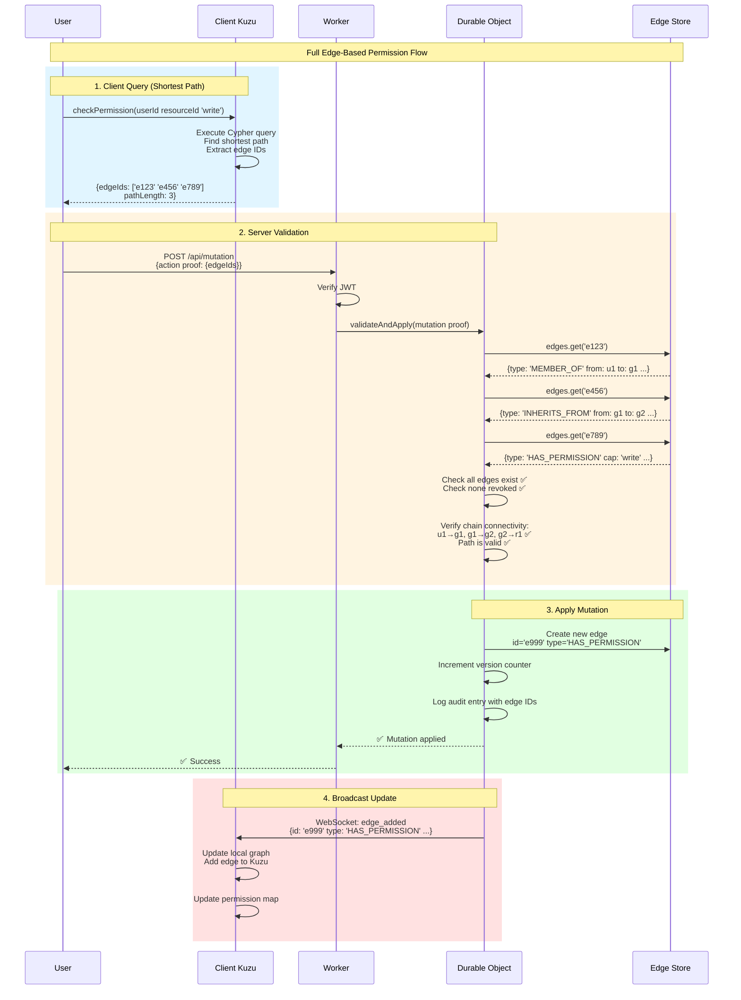

## Edge Storage in Durable Object

```typescript
class GraphStateDO {
  // Primary edge storage - O(1) lookup by ID
  private edges: Map<string, Edge> = new Map();
  
  // Index by source node - O(1) lookup of all edges from a node
  private edgesBySource: Map<string, Set<string>> = new Map();
  
  // Index by target node - O(1) lookup of all edges to a node
  private edgesByTarget: Map<string, Set<string>> = new Map();
  
  // Index by type - O(1) lookup of all edges of a type
  private edgesByType: Map<string, Set<string>> = new Map();
  
  /**
   * Validate that a permission path exists AND forms a valid chain
   * @param edgeIds - Edge IDs returned from client Kuzu query
   * @param userId - User attempting the action
   * @param resourceId - Target resource
   * @returns true if all edges exist, are not revoked, AND form a connected path
   */
  async validatePermissionPath(
    edgeIds: string[],
    userId: string,
    resourceId: string
  ): Promise<{
    valid: boolean;
    reason?: string;
    invalidEdgeId?: string;
    brokenChainAt?: number;
  }> {
    if (edgeIds.length === 0) {
      return { valid: false, reason: 'No edges provided' };
    }

    // Fetch all edges
    const edges: Edge[] = [];
    for (const edgeId of edgeIds) {
      const edge = this.edges.get(edgeId);
      
      if (!edge) {
        return {
          valid: false,
          reason: 'Edge does not exist',
          invalidEdgeId: edgeId
        };
      }
      
      if (edge.revokedAt) {
        return {
          valid: false,
          reason: 'Edge has been revoked',
          invalidEdgeId: edgeId
        };
      }
      
      edges.push(edge);
    }
    
    // CRITICAL: Verify chain connectivity
    // Edge[i].target must equal Edge[i+1].source
    
    // First edge must start from the user
    if (edges[0].sourceId !== userId) {
      return {
        valid: false,
        reason: 'First edge does not start from user',
        brokenChainAt: 0
      };
    }
    
    // Check each link in the chain
    for (let i = 0; i < edges.length - 1; i++) {
      if (edges[i].targetId !== edges[i + 1].sourceId) {
        return {
          valid: false,
          reason: `Chain broken: edge ${i} target (${edges[i].targetId}) != edge ${i+1} source (${edges[i+1].sourceId})`,
          brokenChainAt: i
        };
      }
    }
    
    // Last edge must end at the resource
    const lastEdge = edges[edges.length - 1];
    if (lastEdge.targetId !== resourceId) {
      return {
        valid: false,
        reason: 'Last edge does not end at resource',
        brokenChainAt: edges.length - 1
      };
    }
    
    return { valid: true };
  }
  
  /**
   * Create a new edge (e.g., permission grant)
   */
  async createEdge(edge: Omit<Edge, 'id' | 'createdAt'>): Promise<Edge> {
    const id = crypto.randomUUID(); // Cryptographically secure
    const newEdge: Edge = {
      ...edge,
      id,
      createdAt: Date.now()
    };
    
    // Store in all indexes
    this.edges.set(id, newEdge);
    this.indexEdge(newEdge);
    
    // Audit log
    await this.logAudit({
      action: 'EDGE_CREATED',
      edgeId: id,
      edgeType: edge.type,
      timestamp: newEdge.createdAt
    });
    
    return newEdge;
  }
  
  /**
   * Revoke an edge (soft delete for audit trail)
   */
  async revokeEdge(edgeId: string): Promise<void> {
    const edge = this.edges.get(edgeId);
    if (!edge) {
      throw new Error('Edge not found');
    }
    
    edge.revokedAt = Date.now();
    
    await this.logAudit({
      action: 'EDGE_REVOKED',
      edgeId,
      edgeType: edge.type,
      timestamp: edge.revokedAt
    });
  }
  
  private indexEdge(edge: Edge): void {
    // Index by source
    if (!this.edgesBySource.has(edge.sourceId)) {
      this.edgesBySource.set(edge.sourceId, new Set());
    }
    this.edgesBySource.get(edge.sourceId)!.add(edge.id);
    
    // Index by target
    if (!this.edgesByTarget.has(edge.targetId)) {
      this.edgesByTarget.set(edge.targetId, new Set());
    }
    this.edgesByTarget.get(edge.targetId)!.add(edge.id);
    
    // Index by type
    if (!this.edgesByType.has(edge.type)) {
      this.edgesByType.set(edge.type, new Set());
    }
    this.edgesByType.get(edge.type)!.add(edge.id);
  }
}
```

### Why Edge-Based Validation Is Secure

#### 1. Server Controls All Edge IDs
- Only server can create edges (with UUIDs)
- Client cannot forge edge IDs
- Edge IDs are cryptographically random (UUID v4)
- All edge mutations logged and audited

#### 2. Chain Connectivity Validation
- Server checks edges exist: `edges.has(edgeId)` - O(1) per edge
- **Server verifies chain**: `edge[i].target === edge[i+1].source`
- Prevents attack: submitting valid but disconnected edges
- O(n) validation (still fast, no graph traversal)
- Example attack prevented:
  ```typescript
  // Malicious client submits valid edges that don't connect:
  edgeIds: [
    'e123', // user1 → groupA
    'e456', // groupB → groupC (disconnected!)
    'e789'  // groupD → resource1 (disconnected!)
  ]
  // Server detects: groupA !== groupB, rejects
  ```

#### 3. Immutable Edge History
- Edges are soft-deleted (revokedAt timestamp)
- Full audit trail of when edge was created/revoked
- Can reconstruct permission state at any point in time
- Compliance-friendly (GDPR, SOC 2)

#### 4. Client Optimization, Server Authority
- Client finds the shortest path (optimization)
- Server validates edges exist AND form connected chain (authority)
- Even if client is compromised:
  - Can't forge edge IDs (server-generated UUIDs)
  - Can't submit disconnected edges (chain validation fails)
  - Can't bypass security (all validation server-side)
- Client can only query faster, not bypass security

#### 5. Defense in Depth

### 5. Attack Resistance

| Attack Vector                   | Mitigation with Edge-Based Validation |
| ------------------------------- | ------------------------------------------------ |
| **Forge edge IDs**            | Server-generated UUIDs (cryptographically random) |
| **Submit disconnected edges**       | Server verifies chain connectivity (target→source) |
| **Replay old proof**       | Edge revocation timestamps checked |
| **Claim false permission path** | Server validates all edge IDs exist + form connected chain |
| **Modify permission graph**     | Only server can create/revoke edges, full audit trail        |
| **Bypass validation**           | All mutations require edge ID + chain validation           |
| **Man-in-the-middle**           | HTTPS + JWT authentication                 |

#### Example Attack Prevented:

```typescript
// ❌ ATTACK: Malicious client submits valid but disconnected edges
const maliciousProof = {
  userId: 'user-123',
  resourceId: 'doc-789',
  edgeIds: [
    'e-abc', // user-123 → team-engineering
    'e-xyz', // team-sales → org-acme (NOT CONNECTED!)
    'e-def'  // org-root → doc-789 (NOT CONNECTED!)
  ]
};

// ✅ SERVER DETECTS: Chain validation fails
const validation = await validatePermissionPath(
  maliciousProof.edgeIds,
  maliciousProof.userId,
  maliciousProof.resourceId
);

// Returns:
{
  valid: false,
  reason: "Chain broken: edge 0 target (team-engineering) != edge 1 source (team-sales)",
  brokenChainAt: 0
}

// Audit log records the attack attempt
await logAuditEntry({
  eventType: 'ATTACK_DETECTED',
  attackType: 'DISCONNECTED_EDGE_CHAIN',
  userId: 'user-123',
  attemptedEdges: maliciousProof.edgeIds,
  result: 'BLOCKED'
});
```

## Map-Based Intermediary Architecture

The permission map serves as a critical fast-path optimization:

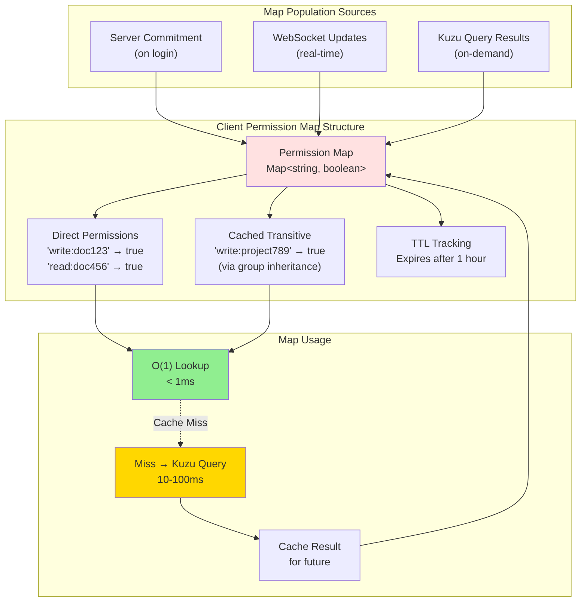

### Map Update Flow

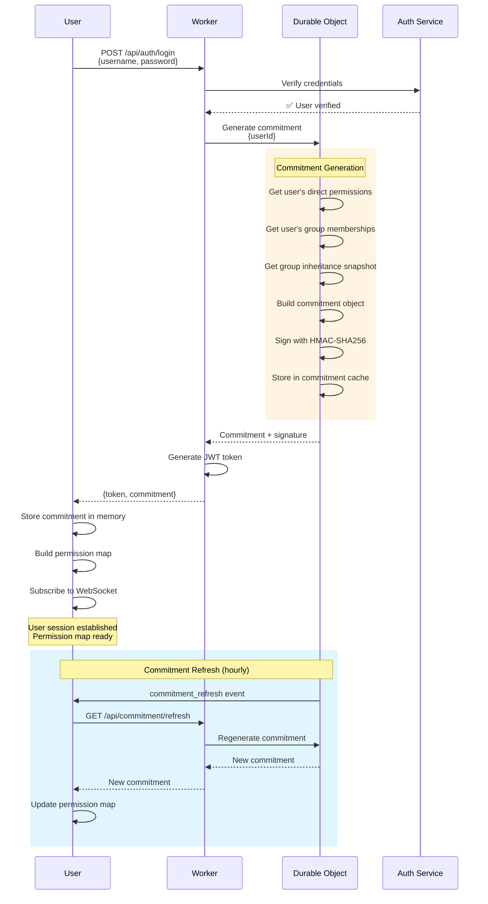

## Cloudflare Services Integration

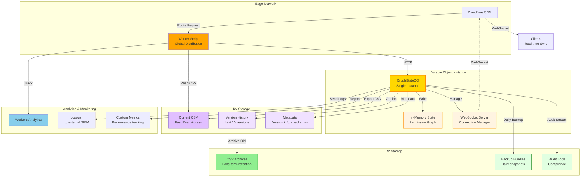

### KV vs R2 Usage Strategy

| Aspect             | KV Store                                                               | R2 Bucket                                                               |
| ------------------ | ---------------------------------------------------------------------- | ----------------------------------------------------------------------- |
| **Purpose**        | Current version + recent history                                       | Long-term archives + backups                                            |
| **Access Pattern** | High-frequency reads                                                   | Infrequent reads                                                        |
| **Data Volume**    | ~10 versions × ~50MB = 500MB                                           | Unlimited historical data                                               |
| **TTL**            | Delete after 10 versions                                               | Lifecycle policies (90+ days)                                           |
| **Performance**    | Edge-cached, <10ms reads                                               | Origin fetch, ~50-200ms                                                 |
| **Cost Model**     | $0.50 per million reads                                                | $0.015 per GB storage                                                   |
| **Use Cases**      | - Current CSV distribution<br/>- Quick rollback<br/>- Version metadata | - Compliance archives<br/>- Disaster recovery<br/>- Audit trail storage |

### Data Flow: DO → KV → R2

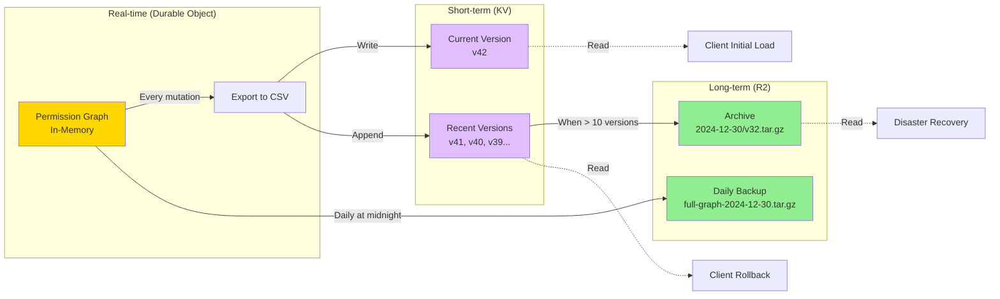

## Commitment Generation Flow

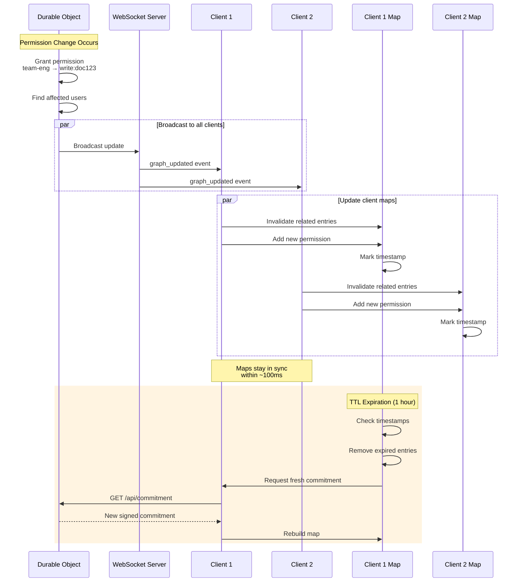

## Why This Is Secure

| CSV export (DO → KV) | 100-500ms | ~50MB total, batched writes |
| CSV fetch (KV → Client) | 50-200ms | Edge-cached, parallel downloads |
| WebSocket sync | <100ms | Delta updates only |
| Initial page load | 1-3s | Parallel: HTML + CSV + auth |

### Performance Optimization Strategy

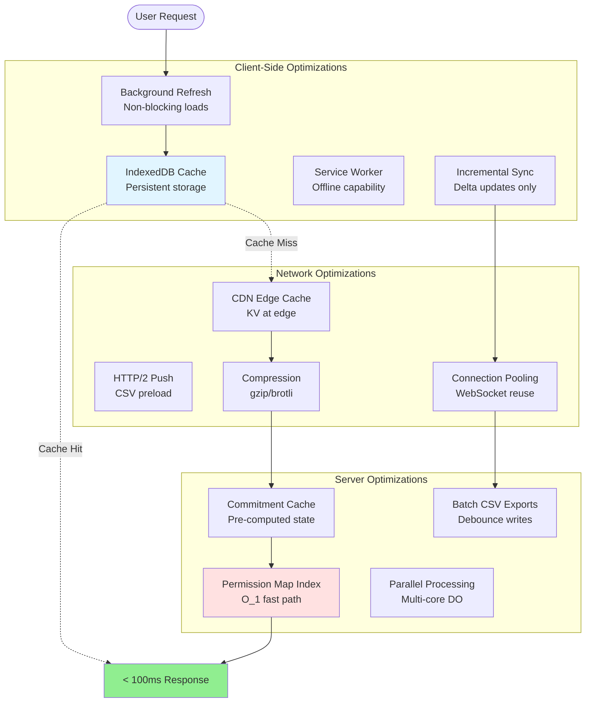

### 1. Server Controls All Edge IDs

- Only server can create edges (generates UUIDs)
- Client cannot modify edges or forge IDs
- All edge mutations logged and audited

### 2. Simplified Commitments

- Only need direct permissions (no inheritance snapshot)
- Smaller payload, faster generation
- Commitments expire after 1 hour

### 3. Edge Existence + Chain Connectivity Validation

- Server checks: `edges.has(edgeId)` for all edges - O(n)
- Server verifies: `edge[i].target === edge[i+1].source` - O(n)
- Ensures user → ... → resource forms valid chain
- Total: O(n) validation (still fast, no graph traversal)

### 4. Defense in Depth

```
┌─────────────────────────────────────────────────┐
│ Layer 1: Authentication                         │
│ - JWT/session tokens                            │
│ - Client signatures                             │
└─────────────────────────────────────────────────┘
           ↓
┌─────────────────────────────────────────────────┐
│ Layer 2: Edge ID Validation                     │
│ - Check all edge IDs exist                      │
│ - Check no edges are revoked                    │
└─────────────────────────────────────────────────┘
           ↓
┌─────────────────────────────────────────────────┐
│ Layer 3: Chain Connectivity Validation          │
│ - Verify first edge starts from user            │
│ - Verify edge[i].target = edge[i+1].source      │
│ - Verify last edge ends at resource             │
└─────────────────────────────────────────────────┘
           ↓
┌─────────────────────────────────────────────────┐
│ Layer 4: Audit Logging                          │
│ - Log exact edge IDs used                       │
│ - Track all permission checks                   │
│ - Record failed attempts + attack patterns      │
└─────────────────────────────────────────────────┘
```

## Implementation Phases

### Phase 1: Edge-Based DO Storage (Week 1-2)

```typescript
// Store edges in Durable Object with multiple indexes
class PermissionGraphDO {
  private edges: Map<string, Edge> = new Map();
  private edgesBySource: Map<string, Set<string>> = new Map();
  private edgesByTarget: Map<string, Set<string>> = new Map();
  private edgesByType: Map<string, Set<string>> = new Map();

  async createEdge(edge: Omit<Edge, 'id' | 'createdAt'>): Promise<Edge> {
    const id = crypto.randomUUID();
    const newEdge = { ...edge, id, createdAt: Date.now() };
    this.edges.set(id, newEdge);
    this.indexEdge(newEdge);
    return newEdge;
  }

  async validatePermissionPath(
    edgeIds: string[],
    userId: string,
    resourceId: string
  ): Promise<{ valid: boolean; reason?: string }> {
    // 1. Check all edges exist and are not revoked
    const edges = edgeIds.map(id => this.edges.get(id)).filter(Boolean);
    if (edges.length !== edgeIds.length) {
      return { valid: false, reason: 'One or more edges do not exist' };
    }
    if (edges.some(e => e.revokedAt)) {
      return { valid: false, reason: 'One or more edges have been revoked' };
    }
    
    // 2. Verify chain connectivity
    if (edges[0].sourceId !== userId) {
      return { valid: false, reason: 'Chain does not start with user' };
    }
    for (let i = 0; i < edges.length - 1; i++) {
      if (edges[i].targetId !== edges[i + 1].sourceId) {
        return { valid: false, reason: `Chain broken at index ${i}` };
      }
    }
    if (edges[edges.length - 1].targetId !== resourceId) {
      return { valid: false, reason: 'Chain does not end at resource' };
    }
    
    return { valid: true };
  }
}
```

### Phase 2: Client Query with Edge IDs (Week 2-3)

```typescript
// Client queries for shortest path with edge IDs
async function checkPermission(userId, resourceId, capability) {
  const result = await kuzuClient.query(`
    MATCH path = (u:User {id: $userId})-[*]->(r:Resource {id: $resourceId})
    WHERE ANY(rel IN relationships(path) WHERE rel.capability = $capability)
    WITH path, [rel in relationships(path) | id(rel)] as edgeIds
    ORDER BY length(path) ASC
    LIMIT 1
    RETURN edgeIds
  `);

  return result.rows[0]?.edgeIds || null;
}
```

### Phase 3: Server Validation with Chain Check (Week 3-4)

```typescript
// Validate edge IDs + chain connectivity on every mutation
app.post("/api/mutate", async (req) => {
  const { mutation, proof } = req.body;

  // Edge ID + chain connectivity validation
  const validation = await graphDO.validatePermissionPath(
    proof.edgeIds,
    req.user.id,
    mutation.resourceId
  );
  
  if (!validation.valid) {
    await logAuditEntry({
      result: 'DENIED',
      reason: validation.reason,
      invalidEdgeId: validation.invalidEdgeId
    });
    throw new UnauthorizedError("Permission denied");
  }

  await applyMutation(mutation);
});
```

### Phase 4: Audit & CSV Export (Week 4-5)

```typescript
// Export graph to CSV with stable edge IDs
interface EdgeCSV {
  id: string;
  type: string;
  source_id: string;
  target_id: string;
  properties_json: string;
  created_at: number;
  revoked_at: number | null;
}

// Client imports CSV and edge IDs match server
await kuzuClient.query(`
  LOAD FROM 'edges.csv' (id STRING, ...) 
  CREATE (source)-[e:${type} {id: id, ...}]->(target)
`);
```

### Audit Trail Architecture (Edge-Based)

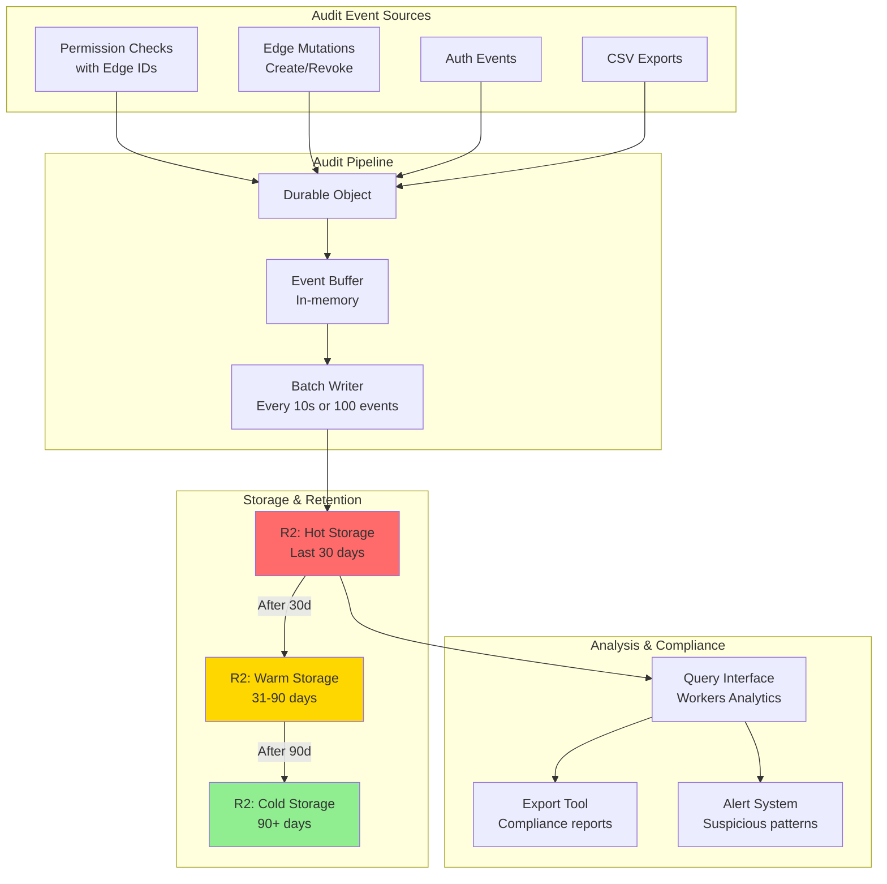

### Audit Event Schema (Edge-Based)

```typescript
interface AuditEvent {
  // Core identification
  eventId: string;              // UUID
  timestamp: number;            // Unix timestamp
  eventType: AuditEventType;    // PERMISSION_CHECK, EDGE_CREATED, etc.

  // User context
  userId: string;
  sessionId: string;
  ipAddress: string;
  userAgent: string;

  // Permission context (edge-based)
  action: string;               // READ, WRITE, DELETE, GRANT, REVOKE
  resourceType: string;         // Document, Project, User, etc.
  resourceId: string;
  capability: string;           // read, write, admin

  // Result with exact edge IDs
  result: 'ALLOWED' | 'DENIED' | 'ERROR';
  edgeIds?: string[];           // Exact edges that granted permission
  invalidEdgeId?: string;       // If denied, which edge was invalid

  // Performance
  latencyMs: number;
  checkType: 'DIRECT' | 'EDGE_VALIDATION' | 'CACHED';

  // Compliance
  complianceFlags: string[];    // ['GDPR', 'SOC2', 'HIPAA']
  retentionPolicy: string;      // '30d', '90d', '7y'
}

// Example audit entry
{
  eventId: "550e8400-e29b-41d4-a716-446655440000",
  timestamp: 1735574400000,
  eventType: "PERMISSION_CHECK",
  userId: "user-123",
  sessionId: "sess-456",
  action: "WRITE",
  resourceId: "doc-789",
  capability: "write",
  result: "ALLOWED",
  edgeIds: ["e-abc", "e-def", "e-ghi"], // Exact permission path
  latencyMs: 5,
  checkType: "EDGE_VALIDATION",
  complianceFlags: ["GDPR", "SOC2"]
}
```

```mermaid
graph TB
    subgraph "Initial Page Load"
        Load1[1. HTML/JS/CSS<br/>from CDN]
        Load2[2. Authenticate<br/>JWT token]
        Load3[3. Get Commitment<br/>signed permissions]
        Load4[4. Fetch CSV<br/>from KV edge]
        Load5[5. Load Kuzu<br/>WASM + Graph]
        Load6[6. Build Map<br/>permission index]
        Load7[7. Connect WS<br/>real-time sync]
    end

    subgraph "Permission Check (Fast Path)"
        Fast1[User action<br/>read:doc123]
        Fast2[Check Map<br/>O_1 lookup]
        Fast3[✅ Allowed<br/>< 1ms]
    end

    subgraph "Permission Check (Transitive)"
        Trans1[User action<br/>admin:project]
        Trans2[Map miss]
        Trans3[Query Kuzu<br/>complex Cypher]
        Trans4[Found path<br/>via groups]
        Trans5[Cache in Map]
        Trans6[Generate proof]
        Trans7[Send to server]
        Trans8[Server validates]
        Trans9[✅ Allowed<br/>~50ms total]
    end

    subgraph "Mutation Flow"
        Mut1[User mutation<br/>grant permission]
        Mut2[Include proof]
        Mut3[Server validates]
        Mut4[Apply to DO graph]
        Mut5[Export CSV]
        Mut6[Store in KV]
        Mut7[Broadcast WS]
        Mut8[Clients sync]
        Mut9[Update maps]
        Mut10[✅ Complete<br/>~200ms total]
    end

    subgraph "Background Tasks"
        BG1[Hourly: Commitment refresh]
        BG2[Daily: R2 backup]
        BG3[Continuous: Audit logging]
        BG4[On-demand: CSV export]
    end

    Load1 --> Load2 --> Load3 --> Load4 --> Load5 --> Load6 --> Load7

    Fast1 --> Fast2 --> Fast3

    Trans1 --> Trans2 --> Trans3 --> Trans4 --> Trans5 --> Trans6
    Trans6 --> Trans7 --> Trans8 --> Trans9

    Mut1 --> Mut2 --> Mut3 --> Mut4 --> Mut5 --> Mut6
    Mut6 --> Mut7 --> Mut8 --> Mut9 --> Mut10

    style Load7 fill:#90EE90
    style Fast3 fill:#90EE90
    style Trans9 fill:#FFD700
    style Mut10 fill:#FFA500
```

## Decision Matrix: When to Use What

| Scenario                    | Use This                        | Why                    |
| --------------------------- | ------------------------------- | ---------------------- |
| **Direct permission check** | Client Map (O(1))               | <1ms, no network       |
| **Transitive permission**   | Client Kuzu → Server validation | Complex query + proof  |
| **Permission grant/revoke** | Server mutation → WS sync       | Authority + real-time  |
| **Initial graph load**      | KV → Client                     | Edge-cached, parallel  |
| **Graph update (small)**    | WebSocket delta                 | <100ms sync            |
| **Permission check (edge-based)** | Client query → Server edge validation | Exact edge IDs traced |
| **Graph update (small)** | WebSocket delta | Edge additions/revocations |
| **Graph update (large)**    | KV CSV re-fetch                 | Rare, full consistency |
| **Permission audit**        | R2 audit logs with edge IDs                   | Compliance retention   |
| **Disaster recovery**       | R2 backups                      | Point-in-time restore  |
| **Edge revocation**         | Server-side soft delete               | Audit trail preserved |

## Conclusion

**Client-side KuzuDB with edge-based server validation provides**:

- ✅ Full graph query power (complex transitive queries)
- ✅ **Simple validation** (O(1) edge ID lookups)
- ✅ **Smaller commitments** (no inheritance snapshot needed)
- ✅ Fast performance (Map-based fast path)
- ✅ **Precise audit trail** (exact edge IDs logged)
- ✅ Cloudflare Workers compatible (no server-side Kuzu needed)
- ✅ Real-time synchronization (WebSocket delta updates)
- ✅ Offline capability (IndexedDB cache)
- ✅ Scalable storage (KV + R2 tiered architecture)
- ✅ **Immutable history** (soft-deleted edges for compliance)

**Edge-based validation is superior because**:

1. **Simpler**: `edges.has(id)` vs complex path structure validation
2. **Faster**: O(n) edge lookups vs O(n²) path validation
3. **More secure**: Can't forge UUIDs, exact edges traced
4. **Better audit**: Exact permission path with edge IDs
5. **Smaller payload**: No inheritance snapshot in commitments
6. **Easier debugging**: Traceable edge IDs vs abstract paths

**This architecture turns a limitation into an advantage** by:

1. Leveraging client-side compute for complex queries
2. Maintaining server authority through edge ID validation
3. Optimizing with simple Map lookups
4. Providing precise audit trails with edge IDs
5. Enabling offline-first workflows
6. Distributing load globally via edge caching
7. Maintaining complete compliance with immutable edge history

### GDPR Compliance

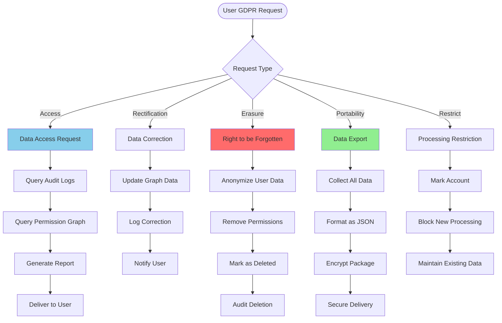

### SOC 2 Requirements

- Access controls validated cryptographically
- All changes audited and timestamped
- Monitoring and alerting in place
- Regular security reviews
- Incident response procedures

### 2. Merkle Tree Commitments

```typescript
// More efficient commitment updates
const merkleRoot = buildMerkleTree(permissionGraph);
const proof = getMerkleProof(merkleRoot, permissionPath);

// Server validates with O(log n) complexity
const isValid = verifyMerkleProof(merkleRoot, proof);
```

### 3. Threshold Cryptography

```typescript
// Distribute trust across multiple servers
const partialSigs = await Promise.all(
  servers.map((s) => s.partialSign(commitment))
);

const fullSignature = combinePartialSignatures(partialSigs);
```

## Performance Characteristics

| Operation                   | Latency  | Notes                         |
| --------------------------- | -------- | ----------------------------- |
| Direct permission check     | <1ms     | Map lookup                    |
| Transitive permission check | <10ms    | Cached inheritance validation |
| Client graph query          | 10-100ms | Full Cypher power             |
| Commitment generation       | 50-200ms | Once per login/change         |
| Mutation validation         | 5-20ms   | Includes audit logging        |

## Compliance & Audit

### Audit Trail

- All permission checks logged with full context
- Permission paths recorded for compliance
- Failed attempts tracked for security

### GDPR Compliance

- Users can export their permission history
- Permission grants/revokes are transparent
- Data retention policies enforced

### SOC 2 Requirements

- Access controls validated cryptographically
- All changes audited and timestamped
- Monitoring and alerting in place

## Conclusion

**Client-side KuzuDB with cryptographic server validation provides**:

- ✅ Full graph query power (complex transitive queries)
- ✅ Strong security guarantees (cryptographic commitments)
- ✅ Fast performance (Map-based fast path)
- ✅ Complete audit trail (all checks logged)
- ✅ Cloudflare Workers compatible (no server-side Kuzu needed)

**This architecture turns a limitation into an advantage** by:

1. Leveraging client-side compute for complex queries
2. Maintaining server authority through cryptographic proofs
3. Optimizing common cases with cached snapshots
4. Providing defense-in-depth security layers
