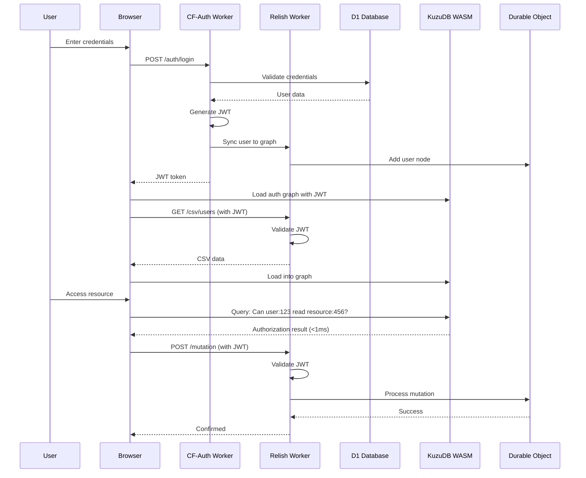

# CF-Auth Integration with Relish

**Date:** January 10, 2026  
**Status:** Planning / Architecture Phase

---

## Overview

This document outlines how to integrate the existing [cf-auth](../../cf-auth/README.md) Pulumi-based authentication infrastructure with Relish's Auth.js + D1 approach for a unified authentication and authorization system.

## Current State

### CF-Auth (Existing)

- **Technology:** Pulumi infrastructure-as-code
- **Database:** Cloudflare D1
- **Email:** AWS SES (50k emails/day free tier)
- **Auth Method:** JWT-based with refresh tokens
- **Password:** PBKDF2 secure hashing
- **Status:** Phase 2 complete ✅
- **Endpoints:** 10 authentication endpoints operational
- **Demo:** Qwik v2 application

### Relish (This Project)

- **Authorization:** Client-side KuzuDB WASM graph queries
- **Sync:** WebSocket + Durable Objects
- **Planned Auth:** Auth.js with D1 adapter
- **Focus:** Sub-1ms authorization checks

---

## Integration Architecture

### Option 1: CF-Auth as Primary (Recommended)

Use cf-auth's existing JWT infrastructure and sync authenticated users to Relish's authorization graph.

```
┌─────────────────┐
│   cf-auth       │
│   (JWT + D1)    │
│                 │
│  Authentication │
└────────┬────────┘
         │
         │ User authenticated
         │ JWT issued
         │
         ▼
┌─────────────────┐
│     Relish      │
│  (KuzuDB WASM)  │
│                 │
│  Authorization  │
└─────────────────┘
```

**Flow:**

1. User authenticates via cf-auth JWT endpoints
2. JWT validated by Cloudflare Worker
3. User info synced to Relish graph as `user:` node
4. Relish performs <1ms authorization checks
5. Mutations flow through Durable Objects with JWT validation

**Benefits:**

- ✅ Leverage existing, tested cf-auth infrastructure
- ✅ Pulumi-managed deployment (IaC)
- ✅ AWS SES email infrastructure ready
- ✅ JWT standard (widely compatible)
- ✅ Refresh token support built-in

### Option 2: Auth.js Primary

Use Auth.js for authentication and integrate cf-auth's email infrastructure.

**Benefits:**

- ✅ OAuth providers (Google, GitHub) out-of-box
- ✅ Session-based (no JWT complexity)
- ✅ Adapter pattern (swap backends)

**Drawbacks:**

- ⚠️ Need to rebuild email verification
- ⚠️ Duplicate D1 schema effort
- ⚠️ Lose Pulumi IaC benefits

### Option 3: Hybrid (Best of Both)

Use cf-auth for email/password + JWT, Auth.js for OAuth providers.

**Benefits:**

- ✅ OAuth from Auth.js
- ✅ Email verification from cf-auth
- ✅ Pulumi IaC from cf-auth
- ✅ JWT + session support

**Drawbacks:**

- ⚠️ Complexity: Two auth systems
- ⚠️ Two D1 databases (or complex schema merge)
- ⚠️ More maintenance burden

---

## Recommended Approach: Option 1 (CF-Auth Primary)

### Phase 1: User Sync

1. **CF-Auth handles authentication:**

   - Login/logout endpoints
   - Email verification (AWS SES)
   - JWT issuance and refresh
   - Password reset

2. **Sync to Relish graph:**

   ```typescript
   // After successful cf-auth login
   async function syncUserToRelish(user: CFAuthUser) {
     const userId = `user:${user.id}`;

     // Add to Relish authorization graph
     await relishClient.mutation({
       type: "upsert_node",
       entity: "User",
       data: {
         id: userId,
         name: user.name,
         email: user.email,
         created_at: user.created_at,
         is_active: true,
       },
     });
   }
   ```

3. **JWT validation in Worker:**

   ```typescript
   export default {
     async fetch(request: Request, env: Env) {
       // Validate JWT from cf-auth
       const token = request.headers
         .get("Authorization")
         ?.replace("Bearer ", "");
       const user = await validateJWT(token, env.JWT_SECRET);

       if (!user) {
         return new Response("Unauthorized", { status: 401 });
       }

       // User authenticated - check authorization via Relish
       const userId = `user:${user.id}`;
       const authorized = await checkRelishPermission(userId, resource, action);

       if (!authorized) {
         return new Response("Forbidden", { status: 403 });
       }

       // Proceed with request...
     },
   };
   ```

### Phase 2: Add OAuth (Optional)

If OAuth providers needed, add Auth.js alongside cf-auth:

```typescript
// OAuth providers via Auth.js
if (url.pathname.startsWith("/auth/oauth/")) {
  const auth = await initializeAuthJS(env);
  return auth.fetch(request);
}

// Email/password via cf-auth
if (url.pathname.startsWith("/auth/")) {
  return cfAuthHandler(request, env);
}
```

### Phase 3: Shared D1 Schema

Merge cf-auth's D1 schema with Auth.js tables:

```sql
-- CF-Auth tables
CREATE TABLE users (...)
CREATE TABLE refresh_tokens (...)
CREATE TABLE email_verifications (...)

-- Auth.js tables (for OAuth)
CREATE TABLE accounts (...)
CREATE TABLE sessions (...)
CREATE TABLE verification_tokens (...)
```

---

## Implementation Plan

### Step 1: Review CF-Auth Infrastructure (Week 1)

- [ ] Review cf-auth codebase structure
- [ ] Understand Pulumi deployment
- [ ] Document JWT flow
- [ ] Test local development setup
- [ ] Review AWS SES integration

### Step 2: Create Sync Layer (Week 1-2)

- [ ] Build user sync service (cf-auth → Relish)
- [ ] Create JWT validation middleware
- [ ] Add user CRUD endpoints in Relish Worker
- [ ] Test user creation/update/delete sync
- [ ] Handle edge cases (user deletion, updates)

### Step 3: Integrate with Relish Worker (Week 2)

- [ ] Add JWT validation to Relish Worker
- [ ] Update WebSocket authentication
- [ ] Modify Durable Object to accept JWT
- [ ] Update client to send JWT in requests
- [ ] Test end-to-end authentication + authorization

### Step 4: Pulumi Deployment (Week 3)

- [ ] Add Relish resources to cf-auth Pulumi stack
- [ ] Deploy Relish Worker alongside cf-auth
- [ ] Configure shared D1 database
- [ ] Set up R2 buckets for CSV storage
- [ ] Deploy KV namespace for mutation log

### Step 5: Email Integration (Week 3)

- [ ] Use cf-auth's AWS SES for Relish notifications
- [ ] Add permission grant notification emails
- [ ] Add group membership notification emails
- [ ] Test email delivery

### Step 6: Testing & Documentation (Week 4)

- [ ] E2E tests with cf-auth + Relish
- [ ] Load testing authentication flow
- [ ] Update documentation
- [ ] Create migration guide
- [ ] Deploy to production

---

## Configuration

### Shared Environment Variables

Add to `wrangler.toml` or Pulumi config:

```toml
[vars]
# CF-Auth JWT
JWT_SECRET = "your-jwt-secret"
JWT_EXPIRES_IN = "15m"
REFRESH_TOKEN_EXPIRES_IN = "7d"

# AWS SES (from cf-auth)
AWS_ACCESS_KEY_ID = "your-aws-key"
AWS_SECRET_ACCESS_KEY = "your-aws-secret"
AWS_SES_REGION = "us-east-1"
AWS_SES_FROM_EMAIL = "noreply@rel.sh"

# Relish Configuration
RELISH_SCHEMA_VERSION = "1.0"

[[d1_databases]]
binding = "AUTH_DB"
database_name = "cf-auth-db"
database_id = "your-d1-id"

[[r2_buckets]]
binding = "CSV_STORAGE"
bucket_name = "relish-csv-storage"

[[kv_namespaces]]
binding = "MUTATION_LOG"
id = "your-kv-id"

[[durable_objects.bindings]]
name = "RELISH_STATE"
class_name = "RelishDurableObject"
```

---

## Data Flow

### Authentication + Authorization Flow



---

## Security Considerations

### JWT Validation

- **Signature:** Verify JWT signature using shared secret
- **Expiry:** Check JWT expiration (15 min recommended)
- **Refresh:** Use refresh tokens for long-lived sessions
- **Revocation:** Track revoked tokens in KV store

### User Sync

- **Consistency:** Sync users on every auth operation
- **Deletion:** Soft delete users (set `is_active = false`)
- **Updates:** Propagate email/name changes to graph
- **Audit:** Log all user sync operations

### Authorization

- **Separation:** Authentication (cf-auth) != Authorization (Relish)
- **Defense in Depth:** Validate both JWT and graph permissions
- **Edge Validation:** Server validates all mutations
- **Cryptographic Proofs:** Use edge UUIDs to prevent tampering

---

## Advantages of This Approach

1. **Leverage Existing Work:** cf-auth is production-ready
2. **Pulumi IaC:** Infrastructure-as-code for all resources
3. **Email Ready:** AWS SES integration complete
4. **JWT Standard:** Wide compatibility, stateless
5. **Clear Separation:** Auth (cf-auth) vs Authz (Relish)
6. **Performance:** JWT validation fast, Relish <1ms queries
7. **Scalability:** Both systems designed for edge computing

---

## Next Steps

1. **Review cf-auth codebase** in detail
2. **Create sync service prototype** (cf-auth → Relish)
3. **Build JWT validation middleware** for Relish Worker
4. **Test integration locally** with both systems running
5. **Deploy to Cloudflare** using Pulumi
6. **Document for developers** with examples

---

## References

- [CF-Auth README](../../cf-auth/README.md)
- [CF-Auth Phase 2 Complete](../../cf-auth/docs/PHASE2_COMPLETE.md)
- [AWS SES Setup](../../cf-auth/docs/AWS_SES_SETUP.md)
- [Relish Project Summary](../PROJECT_SUMMARY.md)
- [Relish Architecture](./ARCHITECTURE.md)

---

**Last Updated:** January 10, 2026  
**Status:** Architecture Planning
