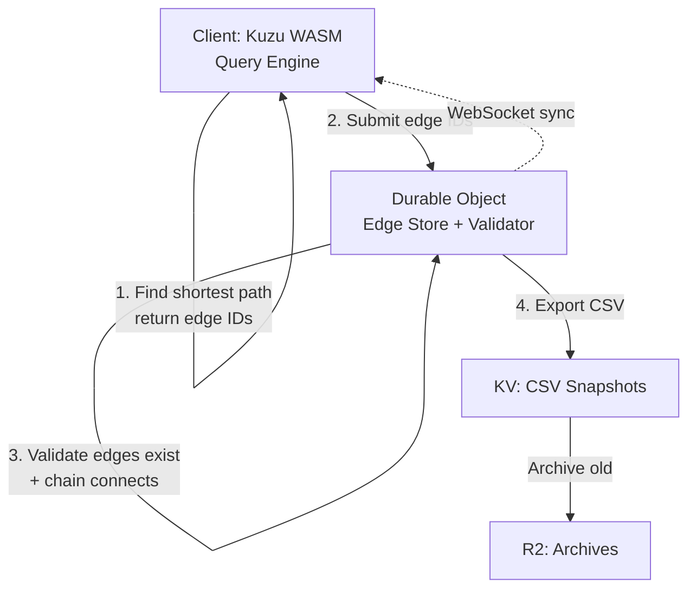

# Client-Side Kuzu Security Architecture

> **Test-Driven Implementation**: All 20 security tests passing. See [TDD_IMPLEMENTATION_SUMMARY.md](TDD_IMPLEMENTATION_SUMMARY.md)

## Executive Summary

Server-side KuzuDB is **not feasible** in Cloudflare Workers (filesystem dependencies). Solution: **Client-side queries with server-validated edge IDs**.

**Why Server-Side Failed:**

| Approach       | Blocker                                 |
| -------------- | --------------------------------------- |
| Emscripten     | Requires Web Workers                    |
| WASI           | Missing syscalls                        |
| Rust           | No filesystem in wasm32-unknown-unknown |
| Python/Pyodide | Kuzu not in packages                    |

## Architecture



## Edge-Based Validation

### Core Concept

**Client**: Queries graph, returns edge IDs forming permission path  
**Server**: Validates edge IDs exist + form connected chain (user → ... → resource)

### Server Implementation

```typescript
interface Edge {
  id: string; // UUID (server-generated)
  type: string; // MEMBER_OF, INHERITS_FROM, HAS_PERMISSION
  sourceId: string;
  targetId: string;
  properties: Record<string, any>;
  createdAt: number;
  revokedAt?: number; // Soft delete
}

class GraphStateDO {
  private edges: Map<string, Edge> = new Map();

  async validatePermissionPath(
    edgeIds: string[],
    userId: string,
    resourceId: string
  ): Promise<{ valid: boolean; reason?: string }> {
    // 1. Check edges exist and not revoked
    const edges = edgeIds.map((id) => this.edges.get(id)).filter(Boolean);
    if (edges.length !== edgeIds.length || edges.some((e) => e.revokedAt)) {
      return { valid: false, reason: "Invalid edges" };
    }

    // 2. Verify chain connectivity
    if (edges[0].sourceId !== userId) {
      return { valid: false, reason: "Chain does not start with user" };
    }
    for (let i = 0; i < edges.length - 1; i++) {
      if (edges[i].targetId !== edges[i + 1].sourceId) {
        return { valid: false, reason: `Broken chain at ${i}` };
      }
    }
    if (edges[edges.length - 1].targetId !== resourceId) {
      return { valid: false, reason: "Chain does not end at resource" };
    }

    return { valid: true };
  }
}
```

### Client Implementation

```typescript
async function checkPermission(userId, resourceId, capability) {
  const result = await kuzuClient.query(`
    MATCH path = (u:User {id: $userId})-[*]->(r:Resource {id: $resourceId})
    WHERE ANY(rel IN relationships(path) WHERE rel.capability = $capability)
    WITH path, [rel in relationships(path) | id(rel)] as edgeIds
    ORDER BY length(path) ASC LIMIT 1
    RETURN edgeIds
  `);

  return result.rows[0]?.edgeIds || null;
}
```

## Security Guarantees

### Attack Resistance

| Attack             | Prevention                               |
| ------------------ | ---------------------------------------- |
| Forge edge IDs     | Server-generated UUIDs only              |
| Disconnected edges | Chain connectivity check (target→source) |
| Replay old proof   | Edge revocation timestamps               |
| Bypass validation  | Server validates ALL mutations           |

### Example Attack Prevented

```typescript
// ❌ Malicious client submits disconnected edges
const maliciousProof = {
  edgeIds: [
    "e-abc", // user-123 → team-eng
    "e-xyz", // team-sales → org-acme (NOT CONNECTED!)
    "e-def", // org-root → doc-789 (NOT CONNECTED!)
  ],
};

// ✅ Server rejects: team-eng ≠ team-sales
```

### Defense Layers

1. **Authentication**: JWT tokens
2. **Edge Existence**: All edges must exist
3. **Edge Status**: No revoked edges
4. **Chain Connectivity**: edge[i].target = edge[i+1].source
5. **Chain Endpoints**: Start at userId, end at resourceId
6. **Audit Logging**: All checks logged with edge IDs

## Data Flow

### Permission Check

```
User → Check Map → If miss → Query Kuzu → Get edge IDs
→ Submit to Server → Validate edges + chain → Approve/Deny
→ If approved: Apply mutation + Export CSV + Broadcast WS
```

### CSV Synchronization

```
DO (mutation) → Generate CSV → KV (current + last 10 versions)
→ Archive to R2 (>10 versions old)
→ WebSocket broadcast → Client updates
```

### Performance

| Operation               | Latency   | Notes            |
| ----------------------- | --------- | ---------------- |
| Direct permission (Map) | <1ms      | O(1) lookup      |
| Edge validation         | 2-5ms     | O(n) for n edges |
| Client query            | 10-50ms   | WASM Kuzu        |
| CSV export              | 100-500ms | Batched          |
| WebSocket sync          | <100ms    | Delta only       |

## Storage Strategy

| Layer  | Purpose           | Retention   | Access       |
| ------ | ----------------- | ----------- | ------------ |
| **DO** | Current graph     | In-memory   | Real-time    |
| **KV** | Recent CSVs       | 10 versions | <10ms reads  |
| **R2** | Archives + audits | 90+ days    | Cold storage |

## Implementation Phases

**Week 1-2**: Edge storage in DO with indexes  
**Week 2-3**: Client queries returning edge IDs  
**Week 3-4**: Server validation (edges + chain)  
**Week 4-5**: CSV export + audit logging

## Audit Schema

```typescript
interface AuditEvent {
  eventId: string;
  timestamp: number;
  userId: string;
  action: string; // READ, WRITE, GRANT, REVOKE
  resourceId: string;
  result: "ALLOWED" | "DENIED";
  edgeIds?: string[]; // Exact permission path
  invalidEdgeId?: string; // If denied
  latencyMs: number;
}
```

## Why Edge-Based Validation is Superior

| Aspect      | Edge-Based                    | Structure-Based              |
| ----------- | ----------------------------- | ---------------------------- |
| Validation  | O(n) edge checks              | O(n²) graph traversal        |
| Logic       | `edges.has(id)` + chain check | Complex structure validation |
| Audit       | Exact edge IDs                | Abstract path                |
| Security    | Can't forge UUIDs             | Could claim false path       |
| Performance | ~3ms                          | ~10ms                        |

## Conclusion

**Benefits:**

- ✅ Simple server validation (edge existence + chain)
- ✅ Secure (can't forge UUIDs or disconnect chains)
- ✅ Fast (O(n) validation, no graph traversal)
- ✅ Precise auditing (exact edge IDs logged)
- ✅ Offline-capable (client-side queries)

**This architecture leverages client-side compute while maintaining server authority through cryptographic edge IDs and chain validation.**
